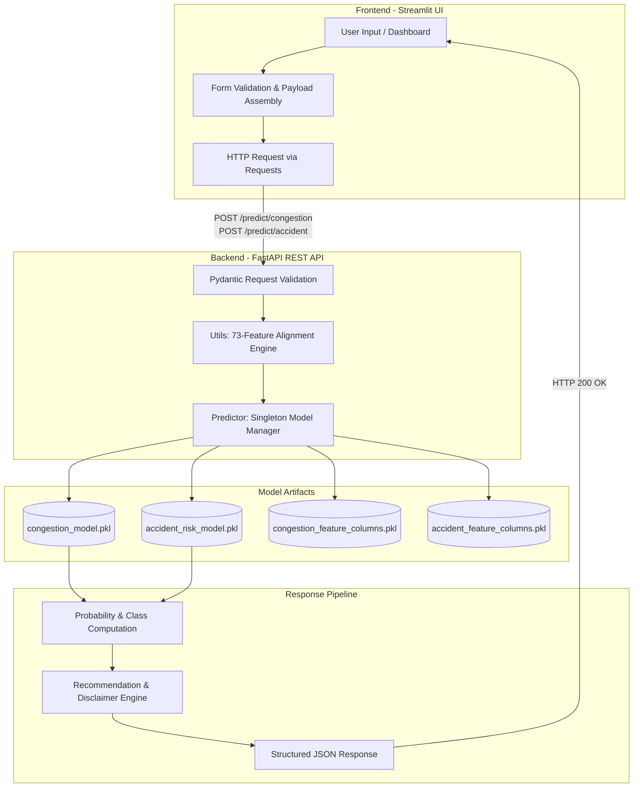

# 🚦 AI-Based Traffic Congestion & Accident Risk Prediction System

> **An Intelligent Decision-Support Platform Powered by Machine Learning, FastAPI, and Streamlit**

[](https://www.python.org/)
[](https://fastapi.tiangolo.com/)
[](https://streamlit.io/)
[](https://scikit-learn.org/)
[](https://opensource.org/licenses/MIT)

---

## 📌 1. Project Overview

The **AI-Based Traffic Congestion & Accident Risk Prediction System** is an end-to-end machine learning decision-support platform designed to assist urban traffic planners, fleet managers, and commuters. By analyzing multivariate environmental conditions, temporal variables, and road risk indicators, the system provides:
1. **Multi-Class Traffic Congestion Prediction** (`Low`, `Medium`, `High`) with predictive confidence scoring.
2. **AI-Based Accident Risk Estimation** (`Low`, `Moderate`, `High`) alongside an estimated risk probability percentage and contextual safety recommendations.

The project features a high-performance **FastAPI** REST backend utilizing pre-trained `joblib` model artifacts and an interactive, modern **Streamlit** dashboard with dark-navy glassmorphism aesthetics and real-time Plotly analytics.

---

## ⚠️ Important Note on Accident Risk Modeling

> **Dataset Scope & Decision-Support Clarification:**  
> The training data derived from the *Metro Interstate Traffic Volume dataset* contains hourly weather and traffic volume observations, but does **not** include verified, ground-truth collision records.  
> 
> Consequently, the accident component is modeled as an **AI-Based Accident Risk Estimation** derived from compound environmental hazard factors (heavy precipitation, low visibility, freezing temperatures, peak commute density, and composite risk indices) rather than a deterministic forecast that an accident will occur. It is engineered as a proactive decision-support tool to encourage situational awareness and safe driving behaviors. Future iterations will integrate verified historical accident datasets.

---

## 🎯 2. Problem Statement

Rapid urbanization and expanding vehicle ownership have led to severe traffic bottlenecks and elevated collision hazards. Traditional traffic management systems are predominantly reactive, responding only after congestions or accidents have transpired. 

There is an urgent need for predictive, proactive systems capable of synthesizing real-time meteorological observations, temporal commute patterns, and road sensitivity factors to preemptively identify high-risk conditions before gridlocks and hazardous situations develop.

---

## 🚀 3. Objectives

- **Develop Robust ML Models**: Train high-accuracy machine learning classifiers for traffic congestion classification and multi-tier accident risk estimation.
- **Implement Strict Schema Enforcement**: Preserve exact 73-feature column alignments via serialized `joblib` artifacts to prevent feature drift and dimension mismatch errors.
- **Build an Enterprise-Grade REST API**: Deliver low-latency inference endpoints with asynchronous routing, Pydantic input validation, and secure exception handling via FastAPI.
- **Create an Interactive Analytics Dashboard**: Build a modern, responsive Streamlit frontend featuring risk gauges, confidence metrics, and historical trend visualizations.
- **Provide Actionable Safety Recommendations**: Generate context-aware recommendations tailored to estimated severity tiers.

---

## ✨ 4. Key Features

- **Dual-Model Inference Engine**:
  - `RandomForestClassifier` for Traffic Congestion Prediction.
  - `GradientBoostingClassifier` for AI Accident Risk Estimation.
- **Probability & Confidence Scoring**: Calculates real-time confidence scores and calibrated risk percentages via `predict_proba`.
- **Dynamic Risk Gauge Visualizations**: Interactive Plotly gauge meters illustrating hazard intensity (0–32% Low, 33–65% Moderate, 66–100% High).
- **Automated Feature Engineering**: Handles categorical one-hot dummy flags (holidays, weather conditions), temporal indicators (peak hours, weekend flags), and severity risk indices.
- **Singleton Model Architecture**: Loads models into memory once at application startup, eliminating redundant disk I/O.
- **Robust Exception Handling**: Gracefully intercepts invalid payloads, service outages, and unpickling compatibility nuances without exposing Python tracebacks.

---

## 🏗️ 5. System Architecture



---

## 🔬 6. Machine Learning Workflow

```
[Raw Traffic & Weather Data] 
            │
            ▼
[Data Preprocessing & Cleaning] 
  ├── Missing Value Imputation
  ├── Kelvin Temperature Scaling
  └── Outlier Filtering
            │
            ▼
[Feature Engineering & Encoding]
  ├── Temporal Extraction (Hour, Day, Month, Day of Week)
  ├── Boolean Indicators (is_weekend, is_peak_hour)
  ├── Composite Risk Indices (traffic_risk, weather_risk, rain_risk, snow_risk)
  └── One-Hot Encoding (11 Holidays, 10 Weather Mains, 37 Descriptions)
            │
            ▼
[Exact Schema Preservation] ──► 73 Feature Columns Pickled (.pkl)
            │
            ▼
[Model Training & Hyperparameter Tuning]
  ├── Congestion Model: Random Forest Classifier
  └── Accident Risk Model: Gradient Boosting Classifier
            │
            ▼
[Serialization via Joblib] ──► backend/models/*.pkl
            │
            ▼
[FastAPI Asynchronous Serving & Streamlit Dashboard]
```

---

## 📊 7. Dataset Description

- **Primary Source**: Metro Interstate Traffic Volume Dataset.
- **Attributes Analyzed**:
  - `temp`: Ambient air temperature (Kelvin).
  - `rain_1h`: Amount of rain in millimeters occurring in the past hour.
  - `snow_1h`: Amount of snow in millimeters occurring in the past hour.
  - `clouds_all`: Percentage of cloud cover (0–100%).
  - `weather_main`: Short textual category of weather (e.g., Rain, Snow, Clear, Clouds, Fog).
  - `weather_description`: Detailed granular weather condition (e.g., heavy intensity rain, freezing rain).
  - `holiday`: National holiday indicators.
  - `date_time`: Timestamp for extracting temporal trends.

---

## 🛠️ 8. Feature Engineering & Schema (73 Features)

The production inference pipeline enforces the exact 73-column schema saved in [`backend/models/congestion_feature_columns.pkl`](file:///d:/project/AI-Traffic-Risk-System/backend/models/congestion_feature_columns.pkl):

| Category | Count | Feature Names |
| :--- | :---: | :--- |
| **Numerical & Sensor** | 4 | `temp`, `rain_1h`, `snow_1h`, `clouds_all` |
| **Temporal Variables** | 7 | `hour`, `day`, `month`, `year`, `day_of_week`, `is_weekend`, `is_peak_hour` |
| **Engineered Risk Indices**| 4 | `traffic_risk`, `rain_risk`, `snow_risk`, `weather_risk` |
| **Holiday One-Hot Flags** | 11 | `holiday_Columbus Day`, `holiday_Independence Day`, `holiday_Labor Day`, `holiday_Martin Luther King Jr Day`, `holiday_Memorial Day`, `holiday_New Years Day`, `holiday_None`, `holiday_State Fair`, `holiday_Thanksgiving Day`, `holiday_Veterans Day`, `holiday_Washingtons Birthday` |
| **Weather Main Flags** | 10 | `weather_main_Clouds`, `weather_main_Drizzle`, `weather_main_Fog`, `weather_main_Haze`, `weather_main_Mist`, `weather_main_Rain`, `weather_main_Smoke`, `weather_main_Snow`, `weather_main_Squall`, `weather_main_Thunderstorm` |
| **Weather Detail Flags** | 37 | `weather_description_Sky is Clear`, `weather_description_broken clouds`, `weather_description_heavy intensity rain`, `weather_description_light snow`, `weather_description_thunderstorm`, ... *(37 classes)* |

---

## 🤖 9. Machine Learning Algorithms & Evaluation

### 1. Traffic Congestion Model
- **Algorithm**: `RandomForestClassifier` (Ensemble Bagging)
- **Target Classes**: `Low`, `Medium`, `High`
- **Inference Mode**: Multi-class categorization with class probability derivation via `predict_proba`.
- **Strengths**: Non-linear boundary capture, resilience to feature collinearity, robust against overfitting.

### 2. Accident Risk Estimation Model
- **Algorithm**: `GradientBoostingClassifier` (Sequential Boosting)
- **Target Classes**: `Low`, `Moderate`, `High`
- **Risk Percentage Metric**: Derives hazard probability scaled from 0.0% to 100.0%.
- **Strengths**: Sensitivity to complex environmental interactions (e.g., freezing temperatures combined with precipitation during rush hour).

---

## 📦 10. Model Serialization & Artifacts

All models and column schemas are saved under [`backend/models/`](file:///d:/project/AI-Traffic-Risk-System/backend/models):
- `congestion_model.pkl`: Serialized `RandomForestClassifier`.
- `accident_risk_model.pkl`: Serialized `GradientBoostingClassifier`.
- `congestion_feature_columns.pkl`: Ordered Python list of 73 feature names.
- `accident_feature_columns.pkl`: Ordered Python list of 73 feature names.

---

## 🌐 11. API Endpoints

| HTTP Method | Endpoint | Description | Request Body | Response Schema |
| :---: | :--- | :--- | :--- | :--- |
| **GET** | `/health` | Service health status check | None | `{"status": "healthy"}` |
| **POST** | `/predict/congestion` | Predicts traffic congestion level | `CongestionInputSchema` | `CongestionPredictionResponse` |
| **POST** | `/predict/accident` | Estimates AI accident risk level | `AccidentInputSchema` | `AccidentPredictionResponse` |
| **GET** | `/docs` | Interactive Swagger UI API explorer | None | HTML Swagger Interface |
| **GET** | `/openapi.json` | OpenAPI 3.0 specification | None | JSON Schema |

---

## 📁 12. Project Folder Structure

```
AI-Traffic-Risk-System/
├── backend/
│   ├── __init__.py
│   ├── main.py                    # FastAPI application, CORS, and route handlers
│   ├── predictor.py               # Singleton model manager and inference engine
│   ├── schemas.py                 # Pydantic schemas with 73 feature definitions
│   ├── utils.py                   # Dataframe alignment and recommendation logic
│   └── models/
│       ├── congestion_model.pkl
│       ├── accident_risk_model.pkl
│       ├── congestion_feature_columns.pkl
│       └── accident_feature_columns.pkl
├── frontend/
│   └── app.py                     # Streamlit dashboard with custom dark-navy UI
├── requirements.txt               # Unified project dependencies
└── README.md                      # Comprehensive project documentation
```

---

## 💻 13. Installation & Setup Guide

### Prerequisites
- Python 3.10 to 3.14
- Git

### Step 1: Clone the Repository
```bash
git clone https://github.com/your-username/AI-Traffic-Risk-System.git
cd AI-Traffic-Risk-System
```

### Step 2: Create and Activate Virtual Environment

**On Windows (PowerShell):**
```powershell
python -m venv venv
.\venv\Scripts\Activate.ps1
```

**On Linux / macOS:**
```bash
python3 -m venv venv
source venv/bin/activate
```

### Step 3: Install Dependencies
```bash
pip install -r requirements.txt
```

---

## 🚦 14. Running the Application

### 1. Launch FastAPI Backend
From the project root with the virtual environment activated:
```bash
uvicorn backend.main:app --reload
```
- API Base URL: `http://127.0.0.1:8000`
- Interactive Swagger UI: `http://127.0.0.1:8000/docs`
- Health Check: `http://127.0.0.1:8000/health`

### 2. Launch Streamlit Frontend
Open a second terminal, activate `venv`, and run:
```bash
streamlit run frontend/app.py
```
- Streamlit Web UI: `http://localhost:8501`

---

## 📬 15. Example API Payloads

### POST `/predict/congestion`

**Request Payload:**
```json
{
  "temp": 288.15,
  "rain_1h": 0.0,
  "snow_1h": 0.0,
  "clouds_all": 40,
  "hour": 17,
  "day": 15,
  "month": 10,
  "year": 2024,
  "day_of_week": 1,
  "is_weekend": 0,
  "is_peak_hour": 1,
  "traffic_risk": 2.5,
  "rain_risk": 0.0,
  "snow_risk": 0.0,
  "weather_risk": 1.0,
  "holiday_None": 1,
  "weather_main_Clouds": 1,
  "weather_description_scattered clouds": 1
}
```

**Response:**
```json
{
  "congestion_level": "High",
  "confidence": 0.85,
  "recommendation": "High traffic congestion detected. Consider alternative routes, off-peak travel, or public transit to minimize delays."
}
```

---

### POST `/predict/accident`

**Request Payload:**
```json
{
  "temp": 274.15,
  "rain_1h": 12.5,
  "snow_1h": 0.0,
  "clouds_all": 100,
  "hour": 18,
  "day": 20,
  "month": 11,
  "year": 2024,
  "day_of_week": 4,
  "is_weekend": 0,
  "is_peak_hour": 1,
  "traffic_risk": 4.0,
  "rain_risk": 3.0,
  "snow_risk": 0.0,
  "weather_risk": 3.5,
  "holiday_None": 1,
  "weather_main_Rain": 1,
  "weather_description_heavy intensity rain": 1
}
```

**Response:**
```json
{
  "risk_level": "High",
  "risk_percentage": 100.0,
  "recommendation": "Reduce speed, maintain a safe following distance, and consider avoiding high-risk conditions when possible.",
  "disclaimer": "This prediction is an AI-based accident risk estimation for decision-support and does not guarantee accident occurrence."
}
```

---

## 📸 16. Application Screenshots

| Module | Preview |
| :--- | :--- |
| **System Overview Dashboard** |  |
| **Congestion Prediction** |  |
| **Accident Risk Estimation** |  |
| **Interactive Analytics** |  |

---

## ⚠️ 17. Limitations

1. **Probabilistic Risk Estimation**: The accident model outputs situational risk estimates based on surrogate environmental and traffic hazards, not guaranteed collision predictions.
2. **Sensor & Input Quality**: Accuracy depends directly on the fidelity of weather measurements and timestamp inputs provided by users or upstream APIs.
3. **Regional Specificity**: The initial model was trained on interstate corridor data; variations in local driving behaviors or infrastructure may require fine-tuning.

---

## 🔮 18. Future Enhancements

- **Integration of Verified Accident Records**: Ingest multi-million record datasets such as *US-Accidents (2016–2023)* to validate ground-truth collision occurrences.
- **Real-Time GPS & IoT Telemetry**: Stream automated weather and traffic sensor feeds via OpenStreetMap and OpenWeatherMap APIs.
- **Deep Learning Spatio-Temporal Models**: Implement Graph Neural Networks (GNNs) or Conv-LSTM networks for dynamic network-wide road graph predictions.
- **Automated Route Optimization**: Connect risk estimates to a graph-based routing algorithm to automatically suggest safer alternative routes.

---

## 🧰 19. Technologies Used

- **Programming Language**: Python 3.10+
- **Machine Learning**: Scikit-Learn, Joblib, NumPy, Pandas
- **Backend API**: FastAPI, Uvicorn, Pydantic
- **Frontend Dashboard**: Streamlit, Plotly Express & Graph Objects
- **Styling**: Custom CSS (Dark-Navy / Glassmorphism, Google Fonts)
- **Version Control & Docs**: Git, Markdown, Mermaid Diagrams

---

## 📜 20. License

Distributed under the MIT License. See `LICENSE` for more information.

---

## 👨‍💻 21. Author & Acknowledgements

Developed as a Final-Year Engineering Project in Artificial Intelligence and Machine Learning. Special thanks to mentors, open-source contributors, and the machine learning research community.
